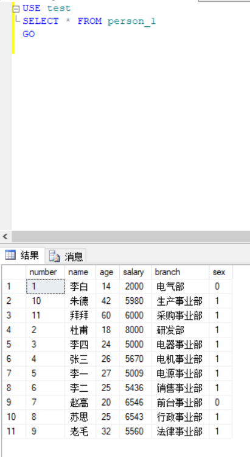

**SELECT 查询语句**  
========

##  数据的添加，删除与修改  
  

>## 简单select语句  
>

>### * 选择所有列  
>  

## DISTINCT 避免重复项  查看一列中有哪些不同的值  
  

## 使用TOP字句返回部分结果  

  

## 查询结果 给表头重命名  
  
  
**三种方法：等号（替换在前），不用符号，AS (原列名在前)**  

## 用where 设置筛选条件（IS NULL 可筛选出NULL值）  
 

## ORDER BY 查询结果排序（ASC|升序，DESC|降序） 
   

## IN 筛选结果范围(WHERE IN WHERE NOT IN)  
  

## LIKE 关键字查询  
#### SQL通配符
    % 匹配0个或或**多个**字符的字符串  
    _ 匹配任何**单个**字符  
    [] 匹配范围集合内的**单个**字符  
    [^] 匹配不在范围和集合内的**单个**字符  
  
  
![[]通配符](pic\QQ拼音截图20200506014146.png)  
![[^]通配符](pic\QQ拼音截图20200506014232.png)  

## BETWEEN 设置结果范围  
  

## AVG COMPUTE  
  

## ORDER BY     COMPUTE AVG   BY  
   

## GROUP BY  
  

## HAVING 条件查询  
  
## where group by [^区别] 

[^区别]: where原始数据筛选，having字句过滤   

  

**复杂查询**
=======
## 嵌套查询  
  

## UNION (列数 列的顺序相同 列数据属性兼容)  
  

## EXISTS 关键字  
  

**连接查询**
======
**笛卡尔积**  
    两个集合 取元素组成二维表  
  

### 加条件 避免笛卡尔积  
  
  
***注意相同的列名要指定所属表***  
  

## 不等值连接  

##  外连接
    左外连接：以左表为基础 右表不足补充null 
     from table1 leftjoin table2 
    右外连接：以右表为基础 左表不足部分 补充null
     from table1 right join table2
    全外连接：显示两表选定所有信息 不足补充null
     from table1 full join table2

**自连接**  
=====
自己连接自己
比如

<u>**游标**</u>
=====
    声明游标 DECLARE cursor_name
            FOR ------

    打开游标 OPEN cursor_name 

**常用函数**  
=====

## 统计函数
>|函数|功能|
>|:--:|:--:|
>|AVG()|平均数|
>|COUNT()|计数|
>|MAX()|最大值|
>|MIN()|最小值|
>|SUM()|求和|  

## 算数函数
>|函数名|功能|
>|:--|:--|
>|ABS(number)|绝对值|  
>|CEILING(number)|向右取整|  
>|ROUND(number,precision)|在小数点哪一位四舍五入|  
>|POWER(number,power)|幂运算|  
>|FLOOR(number)|向左取整|  
>|SQRT(number)|平方根|  
>|SQUAR(number)|平方|  
>|ACOS(number)|浮点值对应弧度角|  
>|ASIN(number)|浮点值对应弧度角|  
>|ATAN(number)|浮点值对应弧度角|  
>|COS(number)|三角函数|  
>|COT(number)|三角函数|  
>|PI()|π值|  
>|TAN(number)|三角函数|  
>|SIN(number)|三角函数|  
>|RAND(number)|0~1之间随机浮点数|  

## 字符串函数  
>|函数|功能|  
>|:--|:--|  
>|LTRIM('   freb')|头部空格|  
>|RTRIM(LTRIM('  fsfsd  '))|尾部空格|  
>|ASCII()|字符转ASCII|  
>|CHAR()|ASCII码转换为字符(0~255之外返回null)|  
>|LOWER()|字符串全转化为小写|  
>|UPPER()|字符串全转化为大写|  
>|STR(number,length,decimal)|数值型转换为字符型，[^规则]|  
[^规则]:str(number,length,decimal)默认长度为10小数点0，指定长度位数应大于等于<符号位数+小数点前位数+小数点位数+小数点后位数>如果小数点前超过指定长度则返回指定长度的*
>|LEFT('str',nuber)|取左边几个字符|  
>|RIGHT('str',number)|取右边几个字符|  
>|SUBSTRING('str',starting_position,lenght)|指定位置取字符|  
>|CHARINDEX('子str','str')|返回子字符串出现开始位置，不能用于TEXT，IMAGE|  
>|PATINDEX('%子str%','str')|可用通配符 用于char，vchar，text|  
>|SOUNDEX|查询声音|  
>|DIFFERENCE()|查询声音|  
>|QUOTENAME('str','{')|加指定括号，默认[]| 
>|REPLICATE('str',num)|重复字符符号返回null|  
>|REVERSE()|取反|  
>|REPLACE('str1','子str1','str3')|替换|  
>|SPACE(num)|返回指定数量空格|  
>|STUFF('str1',start_p,end_p,'str2')|指定位置替换|  
>|时间函数||  
>|系统函数||  
>|||  

**事务和锁**
====

**创建视图**

